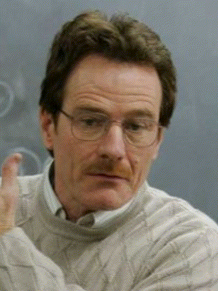

# FaceMorphine
program that morphs face to another face

To run the program you need to python with:
dlib
opencv
numpy

Part 1: Showing the landmark points
Part 2: Human landmarks to cat
Part 3: Delaunay Triangulation
Part 4: Face Morphing

